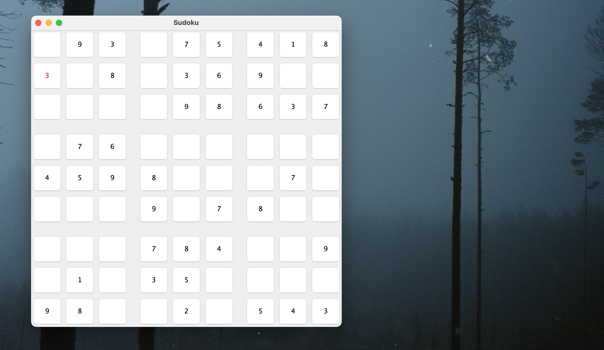

# Sudoku
### Sudoku game built with Java.
Program creates a random Sudoku puzzle for the user to solve.

### Requires
* [Java Development Kit](https://www.oracle.com/java/technologies/downloads/)

### Getting started
* Compile the code by going to the root of this project and running javac *.java
* Then run the command java Main to launch the application.